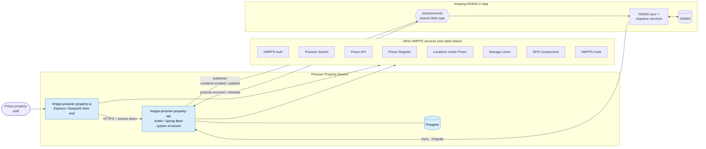
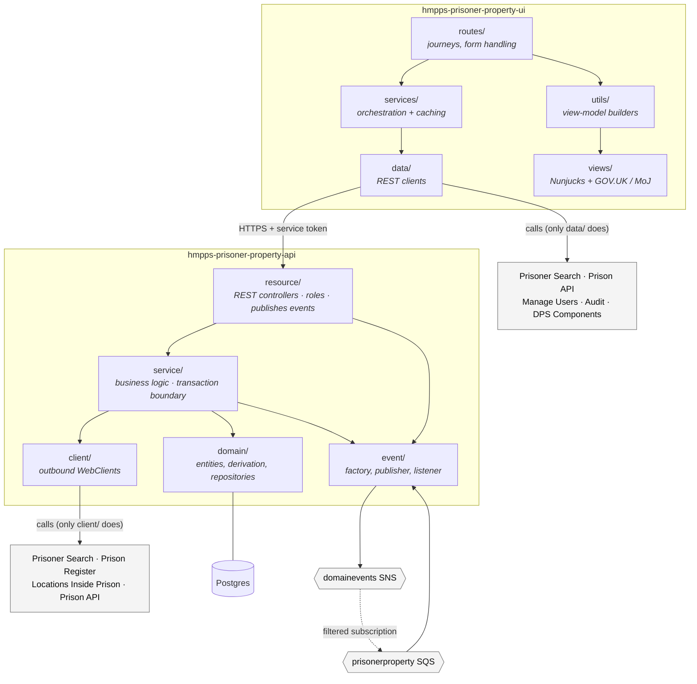
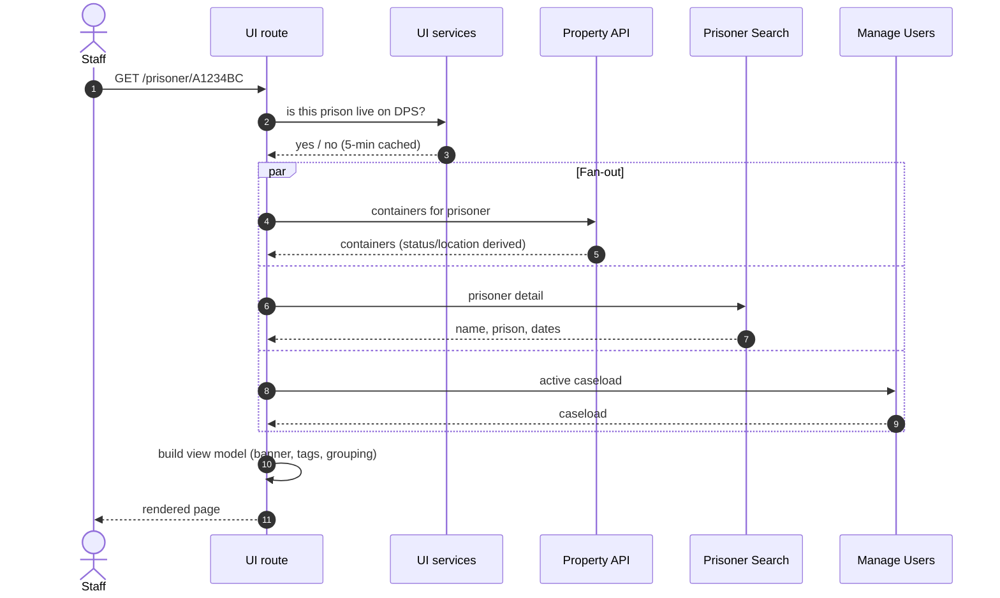
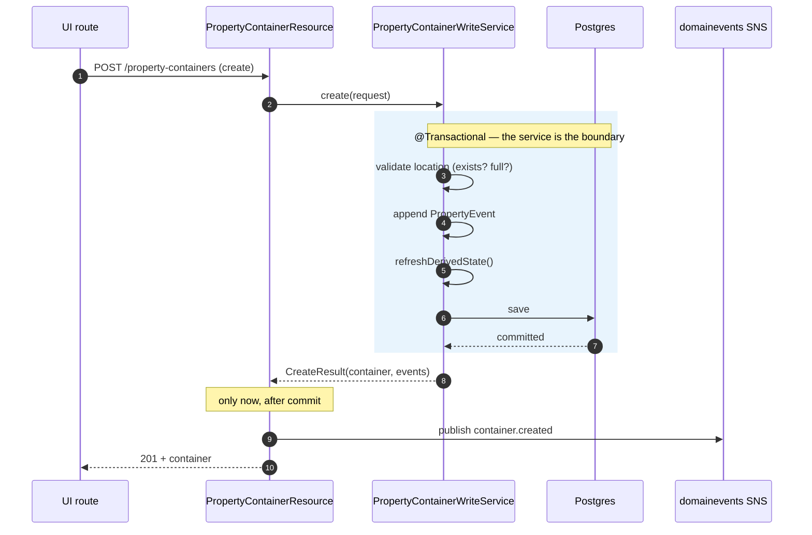
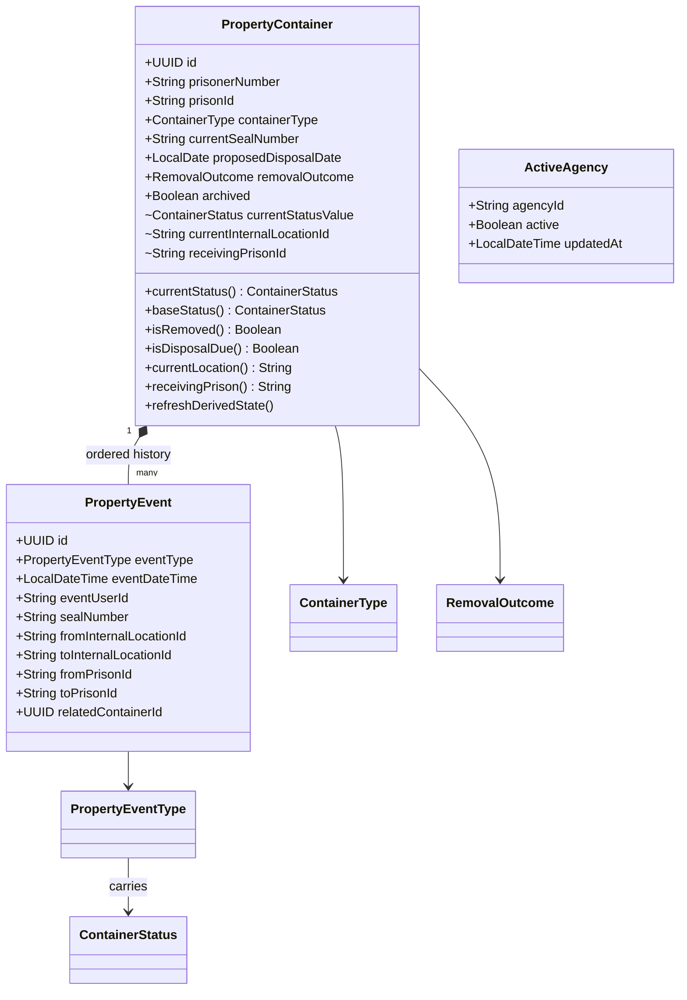

# Prisoner Property Service — Architecture

**Scope:** the whole service — both the API (`hmpps-prisoner-property-api`) and the front end
(`hmpps-prisoner-property-ui`) — and everything they talk to. This is the only architecture document;
each repo's technical doc describes its own internals and links back here for the diagrams.

**Related docs:** [Business overview](business-overview.md) (what the service does and why) ·
[API technical implementation](technical-implementation.md) ·
[UI technical implementation](https://github.com/ministryofjustice/hmpps-prisoner-property-ui/blob/main/docs/technical-implementation.md) ·
[API README](../README.md) (endpoint table, domain model, tech stack, run/deploy)

> **Current as of the initial beta**, while DPS rollout is in progress. The NOMIS sync and the
> per-prison rollout gate described below are transitional by design — see the
> [business overview](business-overview.md) for what changes when rollout completes.

---

## 1. System context

The service is staff-facing: prison staff use the UI, and other HMPPS systems follow along by
subscribing to the events the API publishes.

Which side calls what — kept as a table rather than as arrows, because eight services × two callers is
unreadable as a diagram and rots into spaghetti the moment anything is added:

| Service | Called by | For |
| --- | --- | --- |
| HMPPS Auth | UI + API | Staff sign-in (UI); service tokens (both) |
| Prisoner Search | UI + API | Who someone is, which prison they're in, release dates |
| Prison API | UI + API | Prisoner photo and NOMIS splash screen (UI); admission/transfer history for the timeline (API) |
| Prison Register | API | Prison id → name |
| Locations Inside Prison | **API only** | Storage locations and their capacity |
| Manage Users | UI | The signed-in user's caseload; staff display names |
| DPS Components | UI | Shared DPS header and footer |
| HMPPS Audit | UI | Recording page views |

Two things this diagram is deliberately explicit about:

- **This service never calls NOMIS, and NOMIS never calls it directly.** The two are kept in step by
  separate sync/migration services, which react to our published events and call our `/sync` endpoints.
  That decoupling is why NOMIS appears only at the far edge.
- **The UI does not call Locations Inside Prison.** Storage locations reach the front end only through
  the API. It is a natural wrong assumption, so it is worth stating.

---

## 2. Components

Opening the service box. Both sides are conventionally layered; the arrows crossing between the
subgraphs are the ones that matter.

| Layer | API | UI |
| --- | --- | --- |
| Entry | `resource/` — REST controllers; enforce roles; publish events **after** the service commits | `routes/` — one router per journey step; form validation |
| Logic | `service/` — the transaction boundary; all business rules | `services/` — thin orchestration over the data clients, plus small TTL caches |
| Data | `domain/` — JPA entities + the derivation logic that *is* the model | `data/` — REST clients, one per external API |
| Presentation | `dto/` — the wire contract | `utils/` → `views/` — API shapes turned into template-ready view models |
| Integration | `client/` — outbound WebClients; `event/` — SNS/SQS | `data/` clients; audit via SQS |

---

## 3. Read flow

Most pages are an aggregation: the UI fans out, waits, and assembles. The prisoner property page is
the representative example.

The API's own reads are themselves aggregations — a container list is enriched with prison names
(cached), prisoner detail and location descriptions before it is returned. See the
[API technical doc](technical-implementation.md) for which client supplies what, and
[establishment-summary-counts.md](establishment-summary-counts.md) for how the summary tiles are counted.

---

## 4. Write flow — publish-after-commit

The single most load-bearing pattern in the codebase, and the reason the resource layer looks unusual.
**Services never publish.** They return the container plus the event(s) they *would* raise, and the
resource publishes once the transaction has committed.

Why it matters: a subscriber that reads the API the instant it receives the event must never see
state older than the event implies. Publishing inside the transaction would allow exactly that, and
would also emit an event for a transaction that later rolls back.

The result types carry the events out of the transaction:

| Type | Returned by | Events |
| --- | --- | --- |
| `WriteResult` | update, dispose, remove, move | `event: HmppsDomainEvent?` — **null when nothing changed** (e.g. a move to the same location) |
| `CreateResult` | create | the new container, plus an update for a reconciled transfer-in source |
| `CombineResult` | combine | one created (the new container) + one updated per source |
| `SyncResult` | sync, migrate | `event?` — always null for `migrate`; null for a sync that changed nothing |

The inbound listener follows the same shape: it calls the write service, then publishes the returned
events outside that transaction.

---

## 5. Messaging

Both directions use the **same shared `domainevents` topic** — the queue simply subscribes to it with a
filter. There is no separate inbound topic.

```mermaid
flowchart LR
    subgraph in["Inbound — reacting to the prisoner moving"]
        direction LR
        topic{{"domainevents<br/>SNS"}}
        queue{{"prisonerproperty<br/>SQS (+ DLQ)"}}
        listener["PrisonerEventListener"]
        write["PropertyContainerWriteService"]
        topic -- "filter:<br/>prisoner.received<br/>prisoner.released" --> queue --> listener --> write
    end

    subgraph out["Outbound — telling everyone else"]
        direction LR
        resource2["resource/ (after commit)"]
        pub["DomainEventPublisher"]
        topic2{{"domainevents<br/>SNS"}}
        consumers["NOMIS sync service<br/>+ other subscribers"]
        resource2 --> pub --> topic2 --> consumers
    end

    write -. "raises" .-> resource2
```

**Published:** `prison-property.container.created`, `prison-property.container.updated`. That's all —
there is no removed/deleted type; removal is an *update* that sets a removal outcome.

**Consumed:** `prison-offender-events.prisoner.received` flags property held elsewhere as due for
transfer out. `prison-offender-events.prisoner.released` flags property due for return — but only for
reason `RELEASED`, since the same event also fires for court, temporary absence and transfers. A death
in custody arrives as a release too, distinguished only by NOMIS movement reason code `DEC`, and is
recorded as a distinct event so the history reads correctly. Any other event type is logged and ignored.

---

## 6. Domain model — event sourcing

The heart of the design: **a container's current state is not stored, it is derived.** A
`PropertyContainer` owns an ordered list of immutable `PropertyEvent`s, and status, location and seal
are computed from the most recent relevant event.

Methods are shown alongside fields on purpose: the `+currentStatus()` line is the model in a way the
stored columns are not. The `~` fields are the denormalised mirrors — marked package-internal because
that is exactly what they are: an indexing detail, not part of the model.

Three rules worth carrying in your head:

1. **`removalOutcome` wins.** Once set, the container is removed: `currentStatus()` reports the removal
   status regardless of events, and `currentLocation()` returns null — it isn't anywhere any more.
2. **Disposal is time-based.** `isDisposalDue()` compares `proposedDisposalDate` to today, so a
   container becomes overdue with no write happening. This is why it is never denormalised.
3. **The mirror columns are not the truth.** `currentStatusValue`, `currentInternalLocationId`,
   `currentStorageLocationType` and `receivingPrisonId` exist only so the establishment-wide list can
   filter and paginate in SQL without loading every event. Every write path must call
   `refreshDerivedState()`; the derivation methods remain authoritative.

`ActiveAgency` is separate: one row per prison, recording whether that prison is live on DPS and when it
switched. It gates writes in the UI and labels history in the API.

Enum meanings are in the [README's domain model section](../README.md#domain-model) — not repeated here.

---

## 7. Auth and rollout

**Authentication** is HMPPS Auth throughout. Staff sign in to the UI via the OAuth2 authorisation-code
flow; every onward call uses a **service (client-credentials) token carrying the acting username**, so the
API and downstream services can attribute the action. The API itself is a resource server validating JWTs.

**Authorisation** is by role, enforced independently on each side — the UI hides what you cannot do, the
API refuses it:

| Concern | UI role | API role |
| --- | --- | --- |
| Read property | *(any signed-in user)* | `ROLE_PRISONER_PROPERTY__RO` |
| Create/change/remove/combine | `PRISONERPROP__MANAGE` | `ROLE_PRISONER_PROPERTY__RW` |
| Rollout console | `PRISONERPROP__ADMIN` | `ROLE_PRISONER_PROPERTY__ADMIN` |
| Manage storage locations | `PRISONERPROP__LOCATION_ADMIN` | `ROLE_PRISONER_PROPERTY__LOCATION_ADMIN` |
| NOMIS sync | *(n/a — service to service)* | `ROLE_PRISONER_PROPERTY__SYNC` |

**Rollout** is the `active_agency` flag. A prison is either managing property in DPS or in NOMIS, never
both — so the UI blocks write journeys for staff whose active caseload is a prison that isn't switched
on yet, and the admin console is how a prison gets switched on. The same flag, with its `updatedAt`
timestamp, lets the property history label each arrival with the system in use at that prison *at the
time* — which is why old history can honestly say "property managed in NOMIS".

---

## 8. Environments and deployment

Both services run on Cloud Platform, deployed by Helm from their own repos, promoted dev → preprod →
prod. Neither repo's deployment steps are restated here — see the
[API README](../README.md) and the
[UI README](https://github.com/ministryofjustice/hmpps-prisoner-property-ui/blob/main/README.md).

---

## 9. Glossary

| Term | Meaning |
| --- | --- |
| **Container** | A sealed bag or box holding a prisoner's property. The thing the service tracks. |
| **Seal number** | The number on the tamper-evident seal. Unique across containers currently in storage; changing it is an event. |
| **Event** | An immutable record of something that happened to a container. The container's history *is* its events. |
| **Derived state** | Status, location and seal — computed from the events, not stored. |
| **Removal outcome** | Why a container left storage: returned, disposed, transferred, combined, or created in error. |
| **Active agency** | A prison that is live on DPS for property. The rollout gate. |
| **Branston** | The central warehouse property can be sent to, as opposed to a location inside a prison. |
| **DPS** | Digital Prison Services — the modern services replacing NOMIS. |
| **NOMIS** | The legacy prison system this service is progressively replacing for property. |
