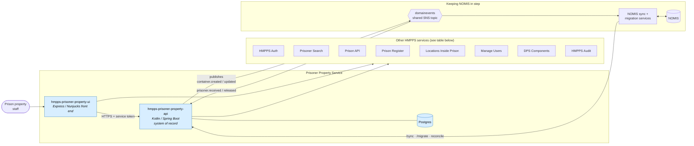
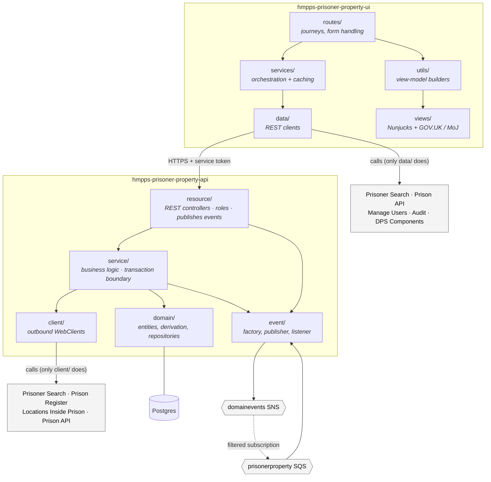
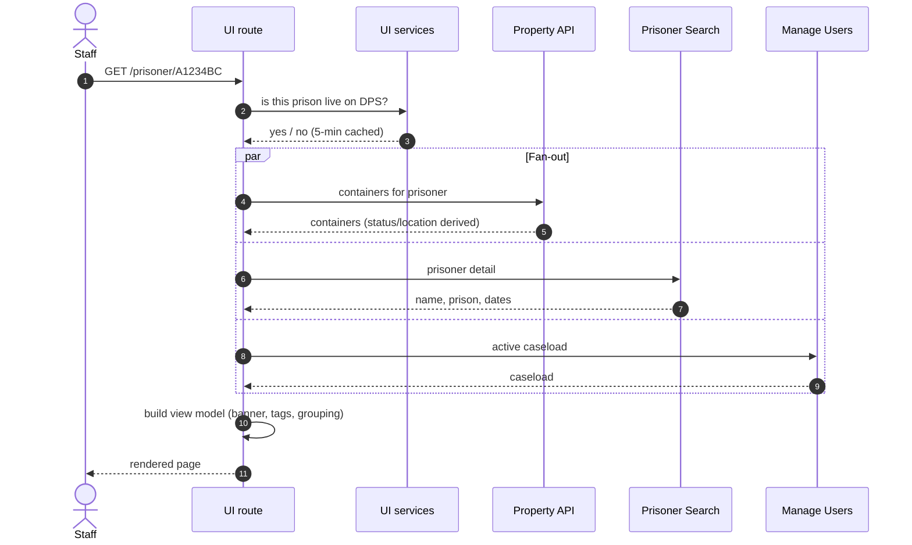
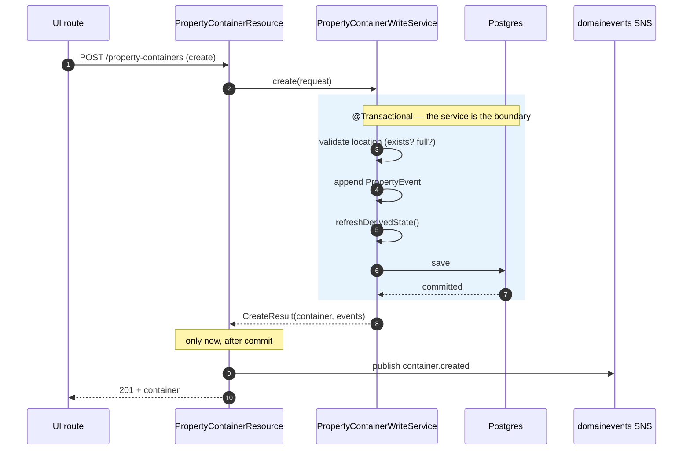
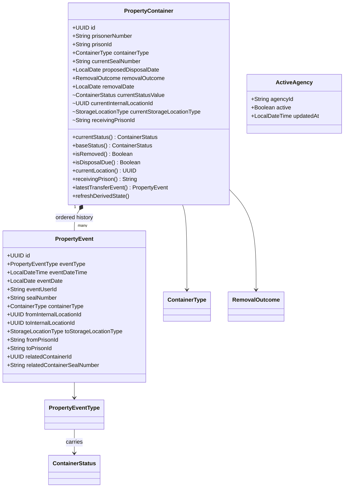

# Prisoner Property Service — Architecture

**Scope:** the whole service — both the API (`hmpps-prisoner-property-api`) and the front end
(`hmpps-prisoner-property-ui`) — and everything they talk to. This is the only architecture document;
each repo's technical doc describes its own internals and links back here for the diagrams.

**Related docs:** [Getting started](getting-started.md) (new to the project? start there) ·
[Business overview](business-overview.md) (what the service does and why) ·
[API technical implementation](technical-implementation.md) ·
[UI technical implementation](https://github.com/ministryofjustice/hmpps-prisoner-property-ui/blob/main/docs/technical-implementation.md) ·
[API README](../README.md) (endpoint table, domain model, tech stack, run/deploy)

> **Current as of the initial beta**, while DPS rollout is in progress. The NOMIS sync and the
> per-prison rollout gate described below are transitional by design — see the
> [business overview](business-overview.md) for what changes when rollout completes.

---

## 1. System context

The service is staff-facing: prison staff use the UI, and other HMPPS systems follow along by
subscribing to the events the API publishes.


```mermaid
flowchart LR
    staff(["Prison property<br/>staff"])

    subgraph svc["Prisoner Property Service"]
        direction TB
        ui["hmpps-prisoner-property-ui<br/><i>Express / Nunjucks front end</i>"]
        api["hmpps-prisoner-property-api<br/><i>Kotlin / Spring Boot<br/>system of record</i>"]
        db[("Postgres")]
        ui -- "HTTPS + service token" --> api
        api --- db
    end

    subgraph deps["Other HMPPS services (see table below)"]
        direction TB
        auth["HMPPS Auth"]
        search["Prisoner Search"]
        prisonapi["Prison API"]
        register["Prison Register"]
        locations["Locations Inside Prison"]
        users["Manage Users"]
        components["DPS Components"]
        audit["HMPPS Audit"]
    end

    subgraph nomisside["Keeping NOMIS in step"]
        direction TB
        events{{"domainevents<br/>shared SNS topic"}}
        nomissync["NOMIS sync +<br/>migration services"]
        nomis[("NOMIS")]
        nomissync <--> nomis
    end

    staff --> ui
    ui --> deps
    api --> deps
    api -- "publishes<br/>container.created / updated" --> events
    events -- "prisoner.received / released" --> api
    events --> nomissync
    nomissync -- "/sync · /migrate · reconcile" --> api

    classDef mine fill:#d8eeff,stroke:#1d70b8,color:#0b0c0c
    class ui,api,db mine
```

Which side calls what — kept as a table rather than as arrows, because eight services × two callers is
unreadable as a diagram and rots into spaghetti the moment anything is added:

| Service | Called by | For |
| --- | --- | --- |
| HMPPS Auth | UI + API | Staff sign-in (UI); service tokens (both) |
| Prisoner Search | UI + API | Who someone is, which prison they're in, release dates |
| Prison API | UI + API | Prisoner photo and NOMIS splash screen (UI); admission/transfer history for the timeline (API) |
| Prison Register | API | Prison id → name |
| Locations Inside Prison | **API only** | Storage locations and their capacity |
| Manage Users | UI | The signed-in user's caseload; staff display names |
| DPS Components | UI | Shared DPS header and footer |
| HMPPS Audit | UI | Recording page views |

Two things this diagram is deliberately explicit about:

- **This service never calls NOMIS, and NOMIS never calls it directly.** The two are kept in step by
  separate sync/migration services, which react to our published events and call our `/sync` endpoints.
  That decoupling is why NOMIS appears only at the far edge. Traffic runs three ways over `/sync`:
  `upsert` for an ongoing NOMIS change, `migrate` for the bulk initial load, and a read pair
  (`GET /ids` then `GET /{id}`) that lets the sync service page through every DPS container and
  reconcile it against what NOMIS holds.
- **The UI does not call Locations Inside Prison.** Storage locations reach the front end only through
  the API. It is a natural wrong assumption, so it is worth stating.

---

## 2. Components

Opening the service box. Both sides are conventionally layered; the arrows crossing between the
subgraphs are the ones that matter.


```mermaid
flowchart TB
    subgraph uibox["hmpps-prisoner-property-ui"]
        direction TB
        routes["routes/<br/><i>journeys, form handling</i>"]
        uisvc["services/<br/><i>orchestration + caching</i>"]
        uidata["data/<br/><i>REST clients</i>"]
        utils["utils/<br/><i>view-model builders</i>"]
        views["views/<br/><i>Nunjucks + GOV.UK / MoJ</i>"]
        routes --> uisvc --> uidata
        routes --> utils --> views
    end

    subgraph apibox["hmpps-prisoner-property-api"]
        direction TB
        resource["resource/<br/><i>REST controllers · roles · publishes events</i>"]
        service["service/<br/><i>business logic · transaction boundary</i>"]
        domain["domain/<br/><i>entities, derivation, repositories</i>"]
        event["event/<br/><i>factory, publisher, listener</i>"]
        client["client/<br/><i>outbound WebClients</i>"]
        resource --> service --> domain
        service --> event
        service --> client
        resource --> event
    end

    ext["Prisoner Search · Prison Register<br/>Locations Inside Prison · Prison API"]
    extui["Prisoner Search · Prison API<br/>Manage Users · Audit · DPS Components"]
    db[("Postgres")]
    sns{{"domainevents SNS"}}
    sqs{{"prisonerproperty SQS"}}

    uidata -- "HTTPS + service token" --> resource
    uidata -- "calls (only data/ does)" --> extui
    client -- "calls (only client/ does)" --> ext
    domain --- db
    event --> sns
    sqs --> event
    sns -. "filtered subscription" .-> sqs

    classDef ext fill:#f4f4f4,stroke:#767676,color:#0b0c0c
    class ext,extui,sns,sqs ext
```

| Layer | API | UI |
| --- | --- | --- |
| Entry | `resource/` — REST controllers; enforce roles; publish events **after** the service commits | `routes/` — one router per journey step; form validation |
| Logic | `service/` — the transaction boundary; all business rules | `services/` — thin orchestration over the data clients, plus small TTL caches |
| Data | `domain/` — JPA entities + the derivation logic that *is* the model | `data/` — REST clients, one per external API |
| Presentation | `dto/` — the wire contract | `utils/` → `views/` — API shapes turned into template-ready view models |
| Integration | `client/` — outbound WebClients; `event/` — SNS/SQS | `data/` clients; audit via SQS |

---

## 3. Read flow

Most pages are an aggregation: the UI fans out, waits, and assembles. The prisoner property page is
the representative example.


```mermaid
sequenceDiagram
    autonumber
    actor Staff
    participant UI as UI route
    participant Svc as UI services
    participant API as Property API
    participant PS as Prisoner Search
    participant MU as Manage Users

    Staff->>UI: GET /prisoner/A1234BC
    UI->>Svc: is this prison live on DPS?
    Svc-->>UI: yes / no (5-min cached)

    par Fan-out
        UI->>API: containers for prisoner
        API-->>UI: containers (status/location derived)
    and
        UI->>PS: prisoner detail
        PS-->>UI: name, prison, dates
    and
        UI->>MU: active caseload
        MU-->>UI: caseload
    end

    UI->>UI: build view model (banner, tags, grouping)
    UI-->>Staff: rendered page
```

The API's own reads are themselves aggregations — a container list is enriched with prison names
(cached), prisoner detail and location descriptions before it is returned. See the
[API technical doc](technical-implementation.md) for which client supplies what, and
[establishment-summary-counts.md](establishment-summary-counts.md) for how the summary tiles are counted.

---

## 4. Write flow — publish-after-commit

The single most load-bearing pattern in the codebase, and the reason the resource layer looks unusual.
**Services never publish.** They return the container plus the event(s) they *would* raise, and the
resource publishes once the transaction has committed.


```mermaid
sequenceDiagram
    autonumber
    participant UI as UI route
    participant R as PropertyContainerResource
    participant W as PropertyContainerWriteService
    participant DB as Postgres
    participant SNS as domainevents SNS

    UI->>R: POST /property-containers (create)
    R->>W: create(request)

    rect rgb(232, 244, 253)
        note over W,DB: @Transactional — the service is the boundary
        W->>W: validate location (exists? full?)
        W->>W: append PropertyEvent
        W->>W: refreshDerivedState()
        W->>DB: save
        DB-->>W: committed
    end

    W-->>R: CreateResult(container, events)
    note over R: only now, after commit
    R->>SNS: publish container.created
    R-->>UI: 201 + container
```

Why it matters: a subscriber that reads the API the instant it receives the event must never see
state older than the event implies. Publishing inside the transaction would allow exactly that, and
would also emit an event for a transaction that later rolls back.

The result types carry the events out of the transaction:

| Type | Returned by | Events |
| --- | --- | --- |
| `WriteResult` | update, dispose, remove, move | `event: HmppsDomainEvent?` — **null when nothing changed** (e.g. a move to the same location) |
| `CreateResult` | create | the new container, plus an update for a reconciled transfer-in source |
| `CombineResult` | combine | one created (the new container) + one updated per source |
| `SyncResult` | sync, migrate | `event?` — always null for `migrate`; null for a sync that changed nothing |

The inbound listener follows the same shape: it calls the write service, then publishes the returned
events outside that transaction.

---

## 5. Messaging

Both directions use the **same shared `domainevents` topic** — the queue simply subscribes to it with a
filter. There is no separate inbound topic.


```mermaid
flowchart LR
    subgraph in["Inbound — reacting to the prisoner moving"]
        direction LR
        topic{{"domainevents<br/>SNS"}}
        queue{{"prisonerproperty<br/>SQS (+ DLQ)"}}
        listener["PrisonerEventListener"]
        write["PropertyContainerWriteService"]
        topic -- "filter:<br/>prisoner.received<br/>prisoner.released" --> queue --> listener --> write
    end

    subgraph out["Outbound — telling everyone else"]
        direction LR
        resource2["resource/ (after commit)"]
        pub["DomainEventPublisher"]
        topic2{{"domainevents<br/>SNS"}}
        consumers["NOMIS sync service<br/>+ other subscribers"]
        resource2 --> pub --> topic2 --> consumers
    end

    write -. "raises" .-> resource2
```

**Published:** `prison-property.container.created`, `prison-property.container.updated`. That's all —
there is no removed/deleted type; removal is an *update* that sets a removal outcome.

Every published event carries a **`source` message attribute** (`PropertyEventSource`: `DPS` or `NOMIS`).
It exists so a subscriber syncing back to NOMIS can discard the events NOMIS itself caused — without it, a
NOMIS change syncs in, publishes, and syncs straight back out again. Filter on it rather than trying to
infer origin from the payload.

**Consumed:** `prison-offender-events.prisoner.received` flags property held elsewhere as due for
transfer out. `prison-offender-events.prisoner.released` flags property due for return — but only for
reason `RELEASED`, since the same event also fires for court, temporary absence and transfers. A death
in custody arrives as a release too, distinguished only by NOMIS movement reason code `DEC`, and is
recorded as a distinct event so the history reads correctly. Any other event type is logged and ignored.

### The payload

```json
{
  "eventType": "prison-property.container.updated",
  "version": 1,
  "occurredAt": "2026-08-05T09:00:00Z",
  "prisonerNumber": "A1234BC",
  "source": "DPS",
  "additionalInformation": {
    "dpsId": "0198c2b4-...",
    "changedFields": ["location", "removalOutcome", "currentStatus"],
    "nomisPropertyContainerId": 12345
  }
}
```

`dpsId` names the container the event is about and is always present. `nomisPropertyContainerId` appears
only on NOMIS-sourced (sync) events. `changedFields` is absent entirely on `.created`.

`changedFields` is **derived, not hand-written** — every write snapshots the container's subscriber-visible
state before mutating and diffs it afterwards (`event/ContainerChangedFields.kt`). The vocabulary is a
fixed set, ordered as listed here:

| Field | Means |
|---|---|
| `sealNumber` | the seal changed |
| `containerType` | standard/excess/valuables/confiscated changed |
| `location` | the internal location *or* the storage location type changed — one entry covers both, because a subscriber sees one location either way |
| `proposedDisposalDate` | the proposed disposal date was set, changed or cleared |
| `removalOutcome` | the container left, or returned to, active storage |
| `currentStatus` | the status shown against the container changed |
| `receivingPrisonId` | the prison it is now due to transfer *in* to changed |

Note that these are not independent: one action usually names several. A removal is never just
`["removalOutcome"]` — the container also gives up its location and changes status. **A subscriber that
filters on `changedFields` must therefore match on the field it cares about, not on an exact list.**

### Which containers get an event

| Write | Events |
|---|---|
| create | one `.created` for the new container — plus one `.updated` for the source when a transfer-in was reconciled |
| update / move / dispose / remove | one `.updated` — or **none**, when the write changed nothing observable |
| combine | one `.created` for the new container **plus one `.updated` per source**, each naming its own `dpsId` |
| prisoner received / released / died | one `.updated` per container actually changed; none for containers already in that state |
| sync upsert | one `.created` or `.updated`, `source: NOMIS`; none when the snapshot changed nothing |
| sync migrate | **none, ever** — bulk replay must not flood the topic |

The multi-container writes are the ones to be careful with: a subscriber that only handles the container
named in the request will miss the other containers the same transaction changed.

---

## 6. Domain model — event sourcing

The heart of the design: **a container's current state is derived from its history.** A
`PropertyContainer` owns an ordered list of immutable `PropertyEvent`s, and status and location are
computed from the most recent relevant event.

Two qualifications, both of which matter more than they look:

- **The seal number is stored**, not derived — `currentSealNumber` is a real column, because uniqueness
  across containers in storage has to be checked in SQL. There is no `currentSeal()` method to go with
  `currentStatus()` and `currentLocation()`.
- **Status and location are also mirrored into columns** (see rule 3 below), and the establishment-wide
  list reads those columns rather than the events. So there are two read paths, and they must agree.


```mermaid
classDiagram
    class PropertyContainer {
        +UUID id
        +String prisonerNumber
        +String prisonId
        +ContainerType containerType
        +String currentSealNumber
        +LocalDate proposedDisposalDate
        +RemovalOutcome removalOutcome
        +LocalDate removalDate
        ~ContainerStatus currentStatusValue
        ~UUID currentInternalLocationId
        ~StorageLocationType currentStorageLocationType
        ~String receivingPrisonId
        +currentStatus() ContainerStatus
        +baseStatus() ContainerStatus
        +isRemoved() Boolean
        +isDisposalDue() Boolean
        +currentLocation() UUID
        +receivingPrison() String
        +latestTransferEvent() PropertyEvent
        +refreshDerivedState()
    }

    class PropertyEvent {
        +UUID id
        +PropertyEventType eventType
        +LocalDateTime eventDateTime
        +LocalDate eventDate
        +String eventUserId
        +String sealNumber
        +ContainerType containerType
        +UUID fromInternalLocationId
        +UUID toInternalLocationId
        +StorageLocationType toStorageLocationType
        +String fromPrisonId
        +String toPrisonId
        +UUID relatedContainerId
        +String relatedContainerSealNumber
    }

    class ActiveAgency {
        +String agencyId
        +Boolean active
        +LocalDateTime updatedAt
    }

    PropertyContainer "1" *-- "many" PropertyEvent : ordered history
    PropertyEvent --> PropertyEventType
    PropertyContainer --> ContainerType
    PropertyContainer --> RemovalOutcome
    PropertyEventType --> ContainerStatus : carries
```

Methods are shown alongside fields on purpose: the `+currentStatus()` line is the model in a way the
stored columns are not. The `~` fields are the denormalised mirrors — marked package-internal because
that is exactly what they are: an indexing detail, not part of the model.

Five rules worth carrying in your head:

1. **`removalOutcome` wins.** Once set, the container is removed: `currentStatus()` reports the removal
   status regardless of events, and `currentLocation()` returns null — it isn't anywhere any more.
   `REMOVED` is the odd one out among the outcomes: it is *reversible*, and clearing it alongside a
   `REACTIVATED` event brings the container back. That is why there is no `archived` flag; there was one,
   and `V14__drop_archived.sql` dropped it in favour of this.
2. **Disposal is time-based.** `isDisposalDue()` compares `proposedDisposalDate` to today, so a
   container becomes overdue with no write happening. This is why it is never denormalised.
3. **The mirror columns are not the truth.** `currentStatusValue`, `currentInternalLocationId`,
   `currentStorageLocationType` and `receivingPrisonId` exist only so the establishment-wide list can
   filter and paginate in SQL without loading every event. Every write path must call
   `refreshDerivedState()`; the derivation methods remain authoritative. **A new write path that forgets
   this compiles, passes its own test, and silently breaks the establishment list and the summary tiles.**
4. **A transfer out is a removal, not a move.** This is the most counter-intuitive thing in the domain and
   the easiest to get wrong. Sending a container to another prison does **not** reassign its `prisonId`.
   It removes the source container with outcome `TRANSFERRED` and exposes `receivingPrisonId`; the
   destination gets a *separate* record when receiving staff log the arrival. The two are reconciled by
   `relatedContainerId` when the seals are matched, in either order. A live container therefore never
   shows `TRANSFER` — `baseEventStatus()` deliberately steps over it — and `currentLocation()` returns null
   after a transfer so the receiving prison assigns its own.
5. **Some questions the columns cannot answer at all**, because they depend on where a container's *owner*
   now is — which lives in prisoner-search, not here. See the next section: this turned out to be a large
   enough idea to need one.

`ActiveAgency` is separate: one row per prison, recording whether that prison is live on DPS and when it
switched. It gates writes in the UI and labels history in the API.

### 6a. Owner location — the status you see is not the status in the column

A container's stored status describes *the container*. What staff need to know is usually about the
**person**: this box is still here, but its owner left last week. No column can answer that, because the
owner's whereabouts live in prisoner-search.

So reads layer an overlay on top of the stored status:

| Component | Job |
| --- | --- |
| `OwnerLocation` | The three answers that matter — owner is `HERE`, `RETURNING` (released or about to be), or `ELSEWHERE` — and `statusFor()`, the single mapping from owner location to displayed status. |
| `PrisonStatusOverlayFactory` | Builds a `StatusOverlay` for one prison: resolves the owners of the property held there in one bulk prisoner-search lookup. |
| `StatusOverlay` | The resolved answer for a set of prisoners, handed to the query and the row mapper. |
| `ContainerStatusResolver` | Applies the precedence — removal, then disposal due, then owner location, then the container's own base status — for both the person view (`effectiveStatus`) and the establishment list (`effectiveStatusFromColumns`). |

Two consequences worth knowing before changing any of it:

- **The status filter is derived from the same mapping, inverted.** `OwnerLocation.persistedStatusesReadingAs`
  is deliberately the inverse of `statusFor`, so filtering by "due for return" cannot select a different set
  of containers than the ones displaying that tag. Change one without the other and the list contradicts
  itself — which is the bug this machinery was built to end (MAPB-725/726).
- **It degrades rather than fails.** If prisoner-search is unavailable the overlay is empty and everything
  falls back to the stored columns: statuses read as they did before, rather than the page erroring.

The incoming ("due to transfer in") list works the same way and for the same reason. `receivingPrisonId`
only records a destination when a reception or transfer-out was written against the container, and ordinary
NOMIS sync traffic resets it — so `incomingScope` also matches property whose owner is on this prison's roll
(`PrisonRollFactory`), and **drops** property addressed here whose owner has demonstrably turned up
somewhere else. Someone in transit or released does not count as having turned up: `TRN` and `OUT` are
sentinels, not establishments, so the recorded destination stands until they actually arrive.

### 6b. Querying the establishment list

`PrisonPropertyFilter` is the resolved set of criteria for the establishment-wide list — search term, type,
status, person location, whether to include removed and incoming property, plus the overlay and roll data
above. `PropertyContainerRepositoryCustom` / `…Impl` build the Criteria API query from it.

One deliberate oddity: the list **pages by prisoner, not by container.** A page is a set of people and all
of their property, so one person's containers can never split across a page boundary — which they would
otherwise do, and which reads as missing property.

`application.yml` sets `hibernate.query.in_clause_parameter_padding: true` specifically for this path: the
overlay binds a variable-size set of prisoner numbers, and without padding every distinct set size compiles
its own statement.

Enum meanings are in the [README's domain model section](../README.md#domain-model) — not repeated here.

---

## 7. Auth and rollout

**Authentication** is HMPPS Auth throughout. Staff sign in to the UI via the OAuth2 authorisation-code
flow; every onward call uses a **service (client-credentials) token carrying the acting username**, so the
API and downstream services can attribute the action. The API itself is a resource server validating JWTs.

**Authorisation** is by role, enforced independently on each side — the UI hides what you cannot do, the
API refuses it:

| Concern | UI role | API role |
| --- | --- | --- |
| Read property | *(any signed-in user)* | `ROLE_PRISONER_PROPERTY__RO` |
| Create/change/remove/combine | `PRISONERPROP__MANAGE` | `ROLE_PRISONER_PROPERTY__RW` |
| Rollout console | `PRISONERPROP__ADMIN` | `ROLE_PRISONER_PROPERTY__ADMIN` |
| Manage storage locations | `PRISONERPROP__LOCATION_ADMIN` | `ROLE_PRISONER_PROPERTY__LOCATION_ADMIN` |
| NOMIS sync | *(n/a — service to service)* | `ROLE_PRISONER_PROPERTY__SYNC` |

**Rollout** is the `active_agency` flag. A prison is either managing property in DPS or in NOMIS, never
both — so the UI blocks write journeys for staff whose active caseload is a prison that isn't switched
on yet, and the admin console is how a prison gets switched on. The same flag, with its `updatedAt`
timestamp, lets the property history label each arrival with the system in use at that prison *at the
time* — which is why old history can honestly say "property managed in NOMIS".

---

## 8. Environments and deployment

Both services run on Cloud Platform, deployed by Helm from their own repos, promoted dev → preprod →
prod. Neither repo's deployment steps are restated here — see the
[API README](../README.md) and the
[UI README](https://github.com/ministryofjustice/hmpps-prisoner-property-ui/blob/main/README.md).

---

## 9. Glossary

| Term | Meaning |
| --- | --- |
| **Container** | A sealed bag or box holding a prisoner's property. The thing the service tracks. |
| **Seal number** | The number on the tamper-evident seal. Unique across containers currently in storage; changing it is an event. |
| **Event** | An immutable record of something that happened to a container. The container's history *is* its events. |
| **Derived state** | Status and location — computed from the events. Also mirrored into columns for the establishment list; the seal number, by contrast, is genuinely stored. |
| **Removal outcome** | Why a container left storage: returned, disposed, transferred, combined, created in error, or removed. The last is reversible; the others are not. |
| **Owner location** | Where the container's *owner* is — here, returning, or elsewhere. Comes from prisoner-search and overrides the container's own status on every screen. |
| **Active agency** | A prison that is live on DPS for property. The rollout gate. |
| **Branston** | The central warehouse property can be sent to, as opposed to a location inside a prison. |
| **DPS** | Digital Prison Services — the modern services replacing NOMIS. |
| **NOMIS** | The legacy prison system this service is progressively replacing for property. |
