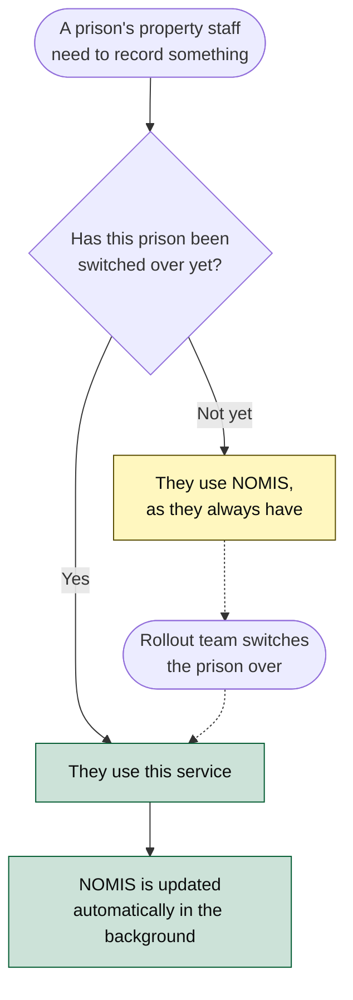

# Prisoner Property Service — What It Does and Why

A plain-English overview of the service: what problem it solves, who uses it, and what it can do. No
technical knowledge assumed. Engineers wanting the internals should start with the
[architecture doc](architecture.md).

> **Current as of the initial beta.** The service is live and being switched on prison by prison. The
> rollout and the link to the old system described below are temporary by design — they end when every
> prison has moved across.

---

## What this service is

When someone arrives in prison, the possessions they can't keep with them are bagged or boxed up, sealed,
and put into storage. That property might sit there for years. It might follow them when they move
prison. It gets handed back when they leave, or — if it's never claimed — eventually destroyed.

This service is how prison staff keep track of all of that. Every sealed bag or box is recorded as a
**container**, and everything that ever happens to it is recorded against it: when it was sealed, where
it's stored, when it moved, when the seal was changed, when it was handed back, transferred or destroyed.

The result is a complete, permanent history for every container — one that stays readable even after the
person has left and the property is long gone.

## Why it exists

Property has always been tracked in **NOMIS**, the decades-old prison system that HMPPS is progressively
replacing. Property in NOMIS is hard to search, offers no real history of what happened to an item, and
can't easily answer questions staff ask constantly — *where is this person's property right now?*, *what's
overdue for disposal?*, *what should have arrived here by now and hasn't?*

This service replaces that part of NOMIS with something purpose-built. The two most valuable differences:

- **A real history.** Nothing is overwritten. Every change is added to the container's record, so you can
  always see what happened, when, and who did it — not just where things stand today.
- **It follows the person.** When someone transfers between prisons, the service knows their property is
  due to follow them, and both the sending and receiving prison can see it.

## Who uses it

**Prison property and reception staff** — the people who actually seal, store, move and return property.
They use the front end, and it is scoped to the prison they're working at.

**Other HMPPS systems** — the service announces every change, so other services can react without anyone
re-keying anything. Most importantly this is how NOMIS is kept up to date during the changeover.

## The rollout: two systems, one at a time

Prisons don't all move at once. Each prison is switched over individually, and until it is, its staff carry
on using NOMIS exactly as before.

The rule that keeps this safe is that **a prison uses one system or the other, never both**. Once a prison
is switched on, this service becomes the place its staff record property, and NOMIS is kept in step
automatically behind the scenes so anything still reading from NOMIS keeps working.

Because the service records *when* each prison was switched over, the history can be honest about the
past: property recorded before a prison moved across is shown as having been managed in NOMIS at the time,
rather than pretending this service was always there.

Switching a prison on is done by the rollout team through an admin screen — no release required.

## What staff can do

| | |
| --- | --- |
| **Find property** | Search the prison's property, or look up everything belonging to one person — including property still held at another prison. |
| **See the full history** | A timeline for a person showing everything that ever happened to their property, alongside their arrivals and transfers. |
| **Record new property** | Seal a new bag or box, record what type it is and where it's stored. |
| **Move it** | Move property to a different storage location, or send it to the central warehouse. |
| **Combine it** | Merge several containers into one new sealed container — with the originals' history preserved. |
| **Hand it back or dispose of it** | Record property returned to the person, transferred to another prison, or destroyed. |
| **Stay ahead of deadlines** | Flags property that's overdue for disposal, or due for return because the person has been released. |
| **Manage storage** | Set up and maintain the storage locations a prison has, and how much each holds. |
| **Run the rollout** | Switch prisons over to the new service, and control the warning staff see in NOMIS. |

## How it fits with the rest of HMPPS

The service deliberately owns only property. Everything else it needs, it asks for:

- **Who someone is, and where they are** — names, current prison, and release dates come from the central
  prisoner records, so this service never holds a second copy that could go stale.
- **Where property can be stored** — the storage locations inside a prison are managed centrally, so
  capacity and layout stay consistent with the rest of the estate.
- **A person's movements** — arrivals and transfers come from the prison record, which is what lets the
  property history show a person's journey alongside their property.
- **Who staff are, and where they work** — sign-in, permissions and the prison someone is working at come
  from the central staff systems.
- **Keeping NOMIS in step** — handled by separate services that listen for changes here and apply them to
  NOMIS. This service never touches NOMIS itself.

Because it announces every change rather than being asked, any future service that cares about property
can subscribe without this one needing to know about it.

## Where to go next

- [Architecture](architecture.md) — how the whole thing is built, with diagrams.
- [API technical implementation](technical-implementation.md) — the back end's internals.
- [UI technical implementation](https://github.com/ministryofjustice/hmpps-prisoner-property-ui/blob/main/docs/technical-implementation.md) — the front end's internals.
