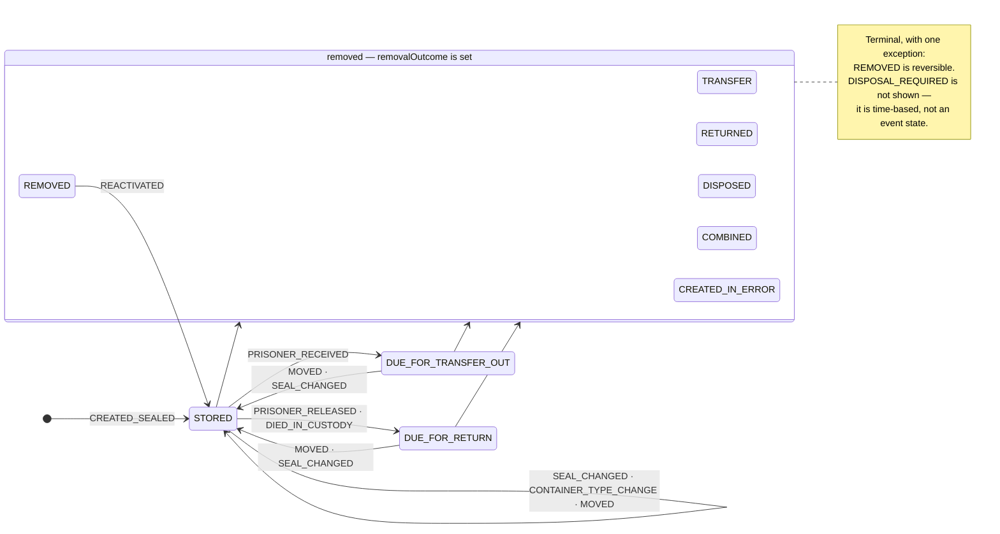

# Getting started — a developer's guide to the prisoner property service

**Who this is for:** you have just joined the project and have both repos checked out. This guide
takes you from "what is this service" to understanding the complexities of the status of a container.

It is a guided tour, not a reference. Where a reference already exists it links out rather than
repeating it: [architecture.md](architecture.md) for the diagrams and messaging topology,
[technical-implementation.md](technical-implementation.md) for this API's internals,
[business-overview.md](business-overview.md) for the non-technical version.

Read this once, top to bottom. It should take about twenty minutes.

---

## 1. What the service is

When someone arrives at a prison, the property they cannot keep with them is sealed into a box and
stored. That box is a **property container**, and this service is the record of it: which box, whose
it is, what seal is on it, where it is stored, and what has happened to it since.

It replaces a set of NOMIS screens, **one prison at a time** — so for now NOMIS and DPS both exist,
each prison uses exactly one of them, and the two are kept in step by a sync. Most of the odd corners
in the codebase trace back to that transition. See [business-overview.md](business-overview.md).

Two repos:

| Repo | What it is |
| --- | --- |
| `hmpps-prisoner-property-api` | Kotlin / Spring Boot. **The system of record.** Owns the database, the rules, and the domain events. |
| `hmpps-prisoner-property-ui` | TypeScript / Express / Nunjucks. **Holds no data of its own** — every screen is assembled from API calls. |

---

## 2. One request, end to end

Follow a single action all the way through: *staff move a container to a different storage location.*

1. **UI route** — `server/routes/journeys/changeContainer.ts`. The journey's steps each validate their
   input and stash it in the **session**; only the final `confirm` step calls the API.
2. **UI data client** — `server/data/prisonerPropertyApiClient.ts` calls `updateContainer`, sending
   `PUT /property-containers/{id}` with a *service* token that carries the acting username.
3. **API resource** — `PropertyContainerResource` checks `ROLE_PRISONER_PROPERTY__RW` via
   `@PreAuthorize`, and calls the write service.
4. **API service** — `PropertyContainerWriteService.update()` is the `@Transactional` boundary. It
   validates the target location against `LocationsClient`, **appends a `MOVED` event** because the
   location changed, and calls `refreshDerivedState()`.
5. **Back in the resource** — the service returned a `WriteResult` carrying the domain event it *would*
   raise. The **resource** publishes it, after the transaction has committed.
6. **SNS** — `prison-property.container.updated` goes to the `domainevents` topic, where the NOMIS sync
   service picks it up and writes the change into NOMIS.

Two things in that list are the house style, and section 6 explains why both matter:
**every write appends an event and then refreshes derived state**, and
**services never publish — resources do.**

---

## 3. The one idea: event sourcing with derived state

A `PropertyContainer` owns an ordered list of `PropertyEvent`s. Its **status and location are not
stored** — they are *computed* by walking those events.

```
PropertyContainer ──1:many──> PropertyEvent
   prisonerNumber                eventType        (what happened)
   prisonId                      eventDateTime
   containerType                 sealNumber       (on seal-bearing events)
   proposedDisposalDate          toInternalLocationId / toStorageLocationType
   removalOutcome                toPrisonId
   removalDate                   containerType    (snapshot, as at this event)
                                 relatedContainerId
```

That is the model. But a purely computed model cannot be filtered or paged in SQL, and the
establishment list has to do both over a whole prison. So **five values are mirrored into columns**:

| Column | Mirrors |
| --- | --- |
| `current_seal_number` | the current seal (also needed for uniqueness checks in SQL) |
| `current_status` | `baseStatus()` |
| `current_internal_location_id` | `currentLocation()` |
| `current_storage_location_type` | `currentLocationType()` |
| `receiving_prison_id` | `receivingPrison()` |

**These columns are a cache, not the truth.** They are rewritten by `refreshDerivedState()`, which
every write path must call.

One value is deliberately *not* mirrored: **disposal**. A container becomes due for disposal simply by
a date passing, with no write occurring, so a mirrored column would go stale. It is recomputed on every
read. `V9__reset_denormalised_disposal_status.sql` exists because it *was* once denormalised, and did.

---

## 4. State transitions

This is the part worth reading twice.

### 4.1 The event types

Fifteen event types, each carrying the `ContainerStatus` it implies
(`domain/PropertyEventType.kt`):

| Event type | Status it carries | Notes |
| --- | --- | --- |
| `CREATED_SEALED` | `STORED` | Carries a seal. The first event on every container. |
| `SEAL_CHANGED` | `STORED` | Carries a seal. |
| `CONTAINER_TYPE_CHANGE` | `STORED` | |
| `MOVED` | `STORED` | Carries a location. |
| `PRISONER_RECEIVED` | `DUE_FOR_TRANSFER_OUT` | The owner turned up at another prison — the property must follow. |
| `PRISONER_RELEASED` | `DUE_FOR_RETURN` | |
| `DIED_IN_CUSTODY` | `DUE_FOR_RETURN` | Released with NOMIS movement reason `DEC`. |
| `TRANSFERRED` | `TRANSFER` | Sent to another prison. **A removal** — see 4.5. |
| `RETURNED` | `RETURNED` | Given back. |
| `DISPOSAL_REQUIRED` | `DISPOSAL_REQUIRED` | **Records a date only** — excluded from status derivation. |
| `DISPOSED` | `DISPOSED` | |
| `COMBINED` | `COMBINED` | Merged into a new container. |
| `CREATED_IN_ERROR` | `CREATED_IN_ERROR` | |
| `REMOVED` | `REMOVED` | Gone, with no recorded reason (typically a NOMIS "inactive" box). |
| `REACTIVATED` | `STORED` | **Undoes a `REMOVED`.** |

### 4.2 The precedence ladder

`PropertyContainer.currentStatus()` asks three questions in this order, and stops at the first hit:

1. **Is `removalOutcome` set?** → that outcome's status wins. Nothing later can un-remove a container;
   a correction such as a reseal must not resurrect a box that has left.
2. **Is disposal due?** (`proposedDisposalDate` today or earlier, and not removed) → `DISPOSAL_REQUIRED`.
3. **Otherwise** → the latest event's status, with two adjustments:
   - `DISPOSAL_REQUIRED` events are **skipped** — they record a date, not a state.
   - `TRANSFER` is mapped to `STORED`. **A live container never shows `TRANSFER`**; that status only
     ever appears via the removal outcome.

One subtlety worth knowing before it bites you: when two events share an `eventDateTime`, the
**later-appended** one wins. That is what lets a `REMOVED` + `REACTIVATED` pair arriving in a single
sync snapshot resolve to "active".

### 4.3 The lifecycle



The three live statuses — `STORED`, `DUE_FOR_TRANSFER_OUT`, `DUE_FOR_RETURN` — are the only ones the
owner-location overlay in 4.4 can touch (`OwnerLocation.LIVE_STATUSES`).

### 4.4 The status on screen is not the status in the column

Here is the thing that catches everyone. There are **four** layers, each adding one rule:

| Layer | What it is | Adds |
| --- | --- | --- |
| `current_status` column | the denormalised mirror | *(nothing — it is a copy of the next row)* |
| `baseStatus()` | removal outcome, else latest event | — |
| `currentStatus()` | as above **plus** the time-based disposal check | disposal |
| `effectiveStatus()` | as above **plus** the owner's location | **where the person is** |

`ContainerStatusResolver.effectiveStatus()` is what every screen shows. Why does the owner's location
override the container's own record? Because the property has to end up wherever the person does — and
the container's status is only as good as the movement events that reached us. NOMIS-migrated property
often has none at all, and a later move or reseal resets its status to `STORED`.

`OwnerLocation` (from prisoner-search) has four values, and `statusFor` maps them over the base status:

| base status ↓ / owner → | `RETURNING` | `ELSEWHERE` | `HERE` | `UNKNOWN` |
| --- | --- | --- | --- | --- |
| `STORED` | `DUE_FOR_RETURN` | `DUE_FOR_TRANSFER_OUT` | `STORED` | `STORED` |
| `DUE_FOR_RETURN` | `DUE_FOR_RETURN` | `DUE_FOR_TRANSFER_OUT` | **`DUE_FOR_RETURN`** | `DUE_FOR_RETURN` |
| `DUE_FOR_TRANSFER_OUT` | `DUE_FOR_RETURN` | `DUE_FOR_TRANSFER_OUT` | `STORED` | `DUE_FOR_TRANSFER_OUT` |

- `RETURNING` — released, or being released within a day. Their property is due back to them.
- `ELSEWHERE` — at another establishment or in transit. Their property must follow.
- `HERE` — in the prison holding the box. It is simply stored.
- `UNKNOWN` — prisoner-search could not answer. The container's own record stands.

**Note the one asymmetry, in bold above.** `HERE` clears a stale `DUE_FOR_TRANSFER_OUT` but
*preserves* `DUE_FOR_RETURN`. A due-for-return is written by a real release or death event, and
prisoner-search is an eventually-consistent cache fed by those same movements — so a lag between the
two would flip correctly flagged property back to "stored". Left standing, the worst case is staff
seeing "due for return" for someone still here, and checking. Cleared, the worst case is a released
person's property quietly going unnoticed. The asymmetry is deliberate; do not "tidy" it.

**And its inverse.** The establishment list filters by status *in SQL*, over the persisted column — so
it needs to run the mapping backwards: given a displayed status, which persisted statuses read as it?
That is `persistedStatusesReadingAs`, computed from `statusFor` over `LIVE_STATUSES`.

> **If you change `statusFor`, you change `persistedStatusesReadingAs` with it.** They are inverses.
> Break the symmetry and the list's status filter selects a different set of rows from the tags the
> list displays — a bug that looks like a data problem and isn't.

### 4.5 A transfer out is a removal, not a move

The single most counter-intuitive rule in the domain.

When a box is sent to another prison, the sending prison's record is **removed** with outcome
`TRANSFERRED`. Its `prisonId` is *not* reassigned. The receiving prison creates a **separate**
container record when staff there log the arrival, and the two are linked afterwards by
`relatedContainerId` on the `TRANSFERRED` event.

So: one physical box, two rows. The reconcile happens on arrival, matched on the previous seal number
(case- and whitespace-insensitively), and deliberately does *not* require the arrival prison to equal
the destination the sender recorded — people and property get diverted.

Until that reconcile happens, `receivingPrison()` keeps returning the destination, which is what makes
in-transit property visible at the prison it is heading to. Once `relatedContainerId` is set, it
returns null.

### 4.6 `REMOVED` is the only reversible outcome

Five removal outcomes are terminal: `DISPOSED`, `RETURNED`, `TRANSFERRED`, `COMBINED`,
`CREATED_IN_ERROR`. `REMOVED` is not — a `REACTIVATED` event clears it and the container returns to
`STORED`, re-deriving its location from its last location event.

There is **no `archived` flag**. There was one; `V14__drop_archived.sql` dropped it in favour of the
reversible `REMOVED` outcome, so removal is the single mechanism for "no longer here". If you see
`archived` mentioned anywhere, it is out of date.

---

## 5. History reads as at each event

Derived state answers *"what is this container now"*. The history and timeline answer a different
question — *"what was true then"* — and must never be built from the live container. A box created as
`STANDARD` and later changed to `EXCESS` has to read `STANDARD` on the entry recording it being added
to storage.

Each entry's details are therefore walked forward through the events. `containerType` is **stored** on
the event as a durable snapshot; `previousContainerType` is **derived at read time** from the preceding
event, so a change can be described as "changed from X to Y". If you add a new detail to the history,
derive it the same way.

---

## 6. Four key things to watch out for

1. **Every write path must call `refreshDerivedState()`** after mutating events or removal state.
   Forgetting it compiles, passes its own unit test, and silently breaks the establishment list and the
   summary tiles. **Nothing in CI catches this.**

2. **Services never publish; resources do.** Services are the transaction boundary and return a
   `WriteResult` / `CreateResult` / `CombineResult` / `SyncResult` carrying the event. The resource
   calls `publishAfterCommit()` once the transaction has committed. Never inject `DomainEventPublisher`
   into a service — publishing inside the transaction announces changes that may still roll back.

3. **`statusFor` and `persistedStatusesReadingAs` are inverses.** See 4.4.

4**A removed container's seal number is freed for re-use.** Uniqueness is checked only against
   containers where `removal_outcome is null`. Two containers can therefore share a seal if one has
   left active storage.

---

## 7. The front end in five points

- **Journeys are hand-rolled session state.** No wizard library. Each step validates and stashes into
  `req.session`; only `confirm` calls the API; the journey is cleared on completion. The shared guard is
  `resolveContext()` in `routes/journeyHelpers.ts`.
- **Combine is the exception** — its entry point is a POST from the person page, so it is the one
  journey you cannot reach by typing a URL.
- **Two gates.** `requireManageRole` answers "may this person do this at all"; `requireActivePrison`
  answers "is this prison on DPS yet". Both are route-level, on write journeys only.
- **Two kinds of token.** `asUser(token)` is used for exactly one call — the signed-in user's own
  caseload. Everything else uses `asSystem(username)`, a service token carrying the acting username.
- **One status palette.** `utils/statusTags.ts` is the single source for status colours, imported by
  the timeline, the establishment list and the person view alike. There used to be several and they
  had drifted. Change it there, not at a call site.

---

## 8. Making your first change

```bash
# API — needs Docker (Testcontainers: Postgres + LocalStack)
./gradlew check                    # tests + ktlint + assemble; what CI runs
./gradlew test --tests "*PropertyContainerWriteServiceTest"

# UI
npm run setup                      # node v24
npm run lint && npm run typecheck && npm run test
```

To run the pair locally, start each repo's `docker compose up` and read the two READMEs — the API's
covers the `dev` profile and running from the IDE, the UI's covers `.env.dev` and OAuth credentials.

**Three convention tests will fail you before a human review does**, and all three are doing you a
favour:

| Test | Fails when |
| --- | --- |
| `OpenApiDocsTest` | a new endpoint lacks full springdoc `@Operation` / `@ApiResponse` annotations |
| `ResourceSecurityTest` | any endpoint has no `@PreAuthorize` |
| `SchemaCommentsTest` | a new table or column has no `COMMENT ON`, or its comment has no `[Sensitivity: …]` tag |

Schema changes go in a **new** `V{n}__*.sql` migration — never an entity-only DDL change.

---

## 9. Where to go next

| Doc | For |
| --- | --- |
| [business-overview.md](business-overview.md) | The non-technical version. Good before talking to users. |
| [architecture.md](architecture.md) | Diagrams, messaging topology, the event payload and `changedFields`. |
| [technical-implementation.md](technical-implementation.md) | This API's packages, services, clients, persistence. |
| [UI technical implementation](https://github.com/ministryofjustice/hmpps-prisoner-property-ui/blob/main/docs/technical-implementation.md) | The front end's internals. |
| [establishment-summary-counts.md](establishment-summary-counts.md) | How the five summary tiles are counted. |
| [runbook.md](runbook.md) | One-off operational procedures. |
| [property-snags.md](property-snags.md) | Known gaps and the reasoning behind past decisions. *Point-in-time record.* |

The best single file to read next is `domain/PropertyContainer.kt`. It is short, and everything in
section 4 is in it.
